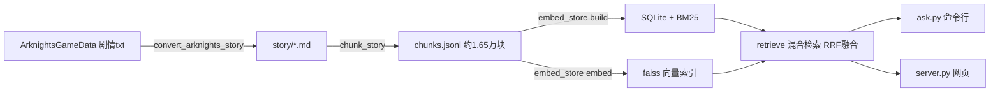

# 明日方舟剧情 RAG 问答系统

基于本地剧情库的《明日方舟》RAG（检索增强生成）问答系统：把游戏剧情转换为结构化 Markdown，切分成对白感知的语料块，用混合检索（向量 + BM25 + RRF 融合）找到最相关的剧情片段，再由大模型生成带引用来源的回答。

> **版权声明**：`story/` 目录下的剧情文本来源于游戏《明日方舟》，版权归 **鹰角网络（Hypergryph）** 所有。本仓库仅将其整理为 Markdown 供个人学习与研究使用，请勿用于商业用途。如有侵权请联系删除。

## 特性

- **对白感知切分**：以"说话人行"为原子条目做滑窗（目标 800 字 / 硬上限 1100），选择支不跨块，相邻块保留 2-3 条重叠台词，上下文前缀标注出处（标题 + 关卡号 + 摘要）
- **混合检索**：faiss 向量检索（百炼 text-embedding-v4，1024 维）+ jieba 分词 BM25（含 12000+ 干员名自定义词表），RRF 融合；30 题评估集上 recall@5 = 1.00，MRR = 0.922
- **两种问答入口**：命令行（多轮对话）与网页（FastAPI + SSE 流式输出，引用可点击查看片段原文）
- **成本友好**：embedding 按内容哈希复用，重跑不重复计费；API key 只存进程内存，不落盘

## 处理流程



## 目录结构

```
arknights-story-rag/
├── convert_arknights_story.py   # 剧情 txt -> Markdown（含主线排序索引）
├── chunk_story.py               # md -> 对白感知语料块 chunks.jsonl
├── embed_store.py               # 入库：SQLite + BM25 + faiss 向量
├── retrieve.py                  # 混合检索（单独测试用）
├── evaluate_retrieval.py        # 检索质量评估（30 题集）
├── diagnose_misses.py           # 未命中案例诊断
├── ask.py                       # 命令行问答（多轮）
├── server.py                    # FastAPI 网页问答
├── static/index.html            # 网页前端
├── embed_config.json            # embedding 端点/模型/维度配置
├── dict_operators.txt           # 干员名 jieba 自定义词表
├── pyproject.toml / uv.lock     # uv 项目配置
└── story/                       # 已转换好的剧情 Markdown（2217 篇）
```

## 快速开始

### 环境准备

- Python 3.12+ 与 [uv](https://docs.astral.sh/uv/)
- 阿里云百炼 API key（用于 embedding 与对话模型，[开通地址](https://bailian.console.aliyun.com/)）
- 需要重新转换剧情时：克隆社区数据仓库 [ArknightsGameData](https://github.com/Arknights/ArknightsGameData)，并把本仓库放在其目录内（或用 `--root` 指定路径）

### 构建索引

```bash
uv sync                                  # 安装依赖

# 1. 转换剧情 (仓库已自带 story/, 想重新生成或更新数据时才需要)
uv run python convert_arknights_story.py

# 2. 切分语料块 -> chunks.jsonl
uv run python chunk_story.py

# 3. 入库
#    embed 需要百炼 key, 先设置环境变量 (PowerShell 写法; CMD 用 set ARK_EMBED_API_KEY=sk-...)
$env:ARK_EMBED_API_KEY="sk-你的百炼key"

uv run python embed_store.py build       # SQLite + BM25, 无需 key
uv run python embed_store.py embed       # faiss 向量, 需要百炼 key

# 4. (可选) 检索质量自测
uv run python evaluate_retrieval.py
```

### 开始提问

命令行（单问 / 多轮）：

```bash
# PowerShell 设置环境变量
$env:ARK_EMBED_API_KEY="sk-你的百炼key"

uv run python ask.py "博士为什么会失忆"
uv run python ask.py --chat              # 多轮对话, exit 退出
uv run python ask.py "弑君者" --speaker 凯尔希 --type 主线   # 过滤检索
```

网页（推荐）：

```bash
uv run python server.py                  # 自动打开 http://127.0.0.1:8600
```

首次打开会弹出 key 输入窗口，校验通过即可开始提问。回答中的 `[n]` 引用可点击查看对应剧情片段原文；右侧设置面板可切换模型（qwen-plus / qwen-max / qwen-flash）、检索方式（混合 / 向量 / BM25）、top-k 与说话人 / 类型过滤。

### 打包为 Windows 免安装软件（可选）

在本机构建单文件夹发行版（内置已建好的检索索引，`dist/` 产物约 400MB）：

```bash
uv add --dev pyinstaller
uv run pyinstaller 剧情问答.spec --noconfirm
# 产物: dist/明日方舟剧情问答/剧情问答.exe, 双击即用, 压缩成 zip 即可分发
```

`剧情问答.spec` 会把静态页、干员词表和索引数据一并打进包里；若想要不含索引的小包（接收者自行建库），删除 spec 中 `datas` 里的 `chunks.sqlite / vectors.faiss / faiss_ids.json / bm25.pkl` 四行再构建。

## 常见问题

- **API key 放在哪里？** 只通过环境变量或网页弹窗传入，运行时保存在进程内存，不写入任何文件。`embed_config.json` 里只有端点和模型名，无敏感信息。
- **embedding 报错 / 很慢？** 百炼 text-embedding-v4 单批上限 10 条，脚本已按此分批并带指数退避重试；1.65 万块全量向量化约几毛钱，重跑按哈希复用已有向量。
- **Windows 下中文乱码？** 脚本已统一 UTF-8 输出；用管道喂 `--chat` 时输入需为 UTF-8 编码。
- **想换对话模型？** 命令行 `--model qwen-max`，网页里在设置面板切换；换 embedding 模型需同步修改 `embed_config.json` 并重建索引。
